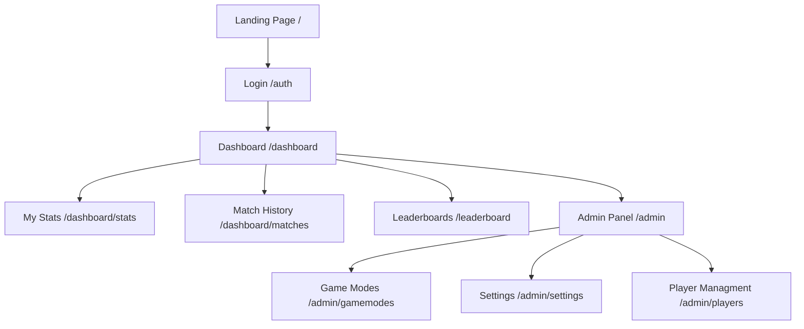

# Nexus Web Dashboard Design Plan

## 1. Executive Summary
The Nexus Web Dashboard serves as the central hub for the Nexus Discord bot, providing players with deep insights into their performance and giving admins powerful tools to manage their competitive communities. The design prioritizes a "Premium Gaming" aesthetic with high responsiveness and seamless Discord integration.

## 2. User Roles & Features

### 2.1 Public / Unauthenticated
*   **Landing Page**: Showcase bot features, "Add to Discord" button, "Login with Discord" button.
*   **Global Leaderboard (Preview)**: Top players across all servers (optional, can be restricted).

### 2.2 Player (Authenticated)
*   **Personal Dashboard**:
    *   **Overview Cards**: Current MMR, Total Wins/Losses, Win Rate, Current Streak.
    *   **Recent Matches**: List of last 5-10 matches with results (Win/Loss, KDA if tracked, teammates).
*   **Stats Profile**: Detailed breakdown of stats per Game Mode (e.g., Valorant MMR vs. LoL MMR).
*   **Leaderboards**: View rankings for their specific Guild(s).

### 2.3 Admin (Authenticated & Authorized)
*   **Server Management**:
    *   **Bot Configuration**: Set prefix (if applicable), toggle modules.
    *   **Game Modes Control**:
        *   Create/Edit/Delete Game Modes (e.g., "5v5 Scrims", "1v1 Duel").
        *   **Toggle Queues**: Open/Close queues instantly.
        *   **Queue Settings**: Team size, Captain picking vs Random, Voice channel generation.
    *   **Player Management**:
        *   Manually adjust MMR (for corrections).
        *   Ban/Unban players from the bot.
    *   **Match Management**:
        *   Void matches (in case of griefing/crashes).
        *   View full match logs.

## 3. Sitemap & Navigation

### Route Structure
*   `/` - Public Landing
*   `/dashboard` - Player Overview (Redirects to login if not auth)
    *   `/dashboard/profile/[userId]` - View other players' profiles
*   `/leaderboard` - Global & Server Rankings
*   `/admin` - Server Selection (if admin of multiple)
    *   `/admin/[guildId]/overview` - Server Stats
    *   `/admin/[guildId]/queues` - Manage Game Modes
    *   `/admin/[guildId]/matches` - Match History & Voiding

## 4. Technical Architecture

### 4.1 Frontend Stack
*   **Framework**: Next.js 15 (App Router)
*   **Language**: TypeScript
*   **Styling**: Tailwind CSS v4
*   **Component Library**: Shadcn UI (Radix Primitives)
    *   *Why?* Accessible, customizable, and fits the "Premium" requirement.
*   **Icons**: Lucide React
*   **Charts**: Recharts (for MMR history graphs)
*   **Data Fetching**: Server Components (RSC) for initial load + SWR/TanStack Query for live updates (queues).

### 4.2 Backend & Data
*   **Database**: Supabase (PostgreSQL) - Direct access via Supabase JS Client.
*   **Authentication**: Supabase Auth with Discord OAuth Provider.
    *   *Scopes*: `identify`, `guilds` (to check admin permissions).
*   **Realtime**: Supabase Realtime for live queue updates on the dashboard.

### 4.3 Integration Points
*   **Bot Control**: The website will write to the `game_modes` and `queues` tables. The Bot (listening via Supabase Realtime or polling) will react to these changes.
    *   *Example*: Admin clicks "Close Queue" on Web -> Updates DB `is_active = false` -> Bot detects change -> Locks Discord channel.

## 5. UI/UX Design Concepts

### 5.1 Visual Style
*   **Theme**: Dark Mode Default. Deep blues/purples (Discord-adjacent) or a sleek "Cyberpunk" black/neon accent.
*   **Typography**: `Inter` or `Rajdhani` (gaming feel) for headers, `Geist Sans` for UI text.
*   **Components**:
    *   **Glassmorphism**: Subtle semi-transparent backgrounds for cards.
    *   **Gradients**: Use gradients for primary buttons and active states.
    *   **Avatars**: Hexagonal or circular frames for player avatars.

### 5.2 Key Interfaces
*   **Stats Card**:
    *   Big number for MMR.
    *   Trend indicator (Green arrow up / Red arrow down).
*   **Match History Table**:
    *   Columns: Date, Mode, Result (Win/Loss), MMR Change (+15), MVP Badge.
*   **Queue Manager (Admin)**:
    *   List of active game modes with "Toggle" switches.
    *   "Edit" button opening a modal to change settings.

## 6. Implementation Roadmap

### Phase 1: Foundation
1.  **Setup**: Install Shadcn UI, Lucide, Recharts.
2.  **Auth**: Configure Supabase Auth Helpers for Next.js.
3.  **Layout**: Create the Shell (Sidebar/Navbar) with User Dropdown.

### Phase 2: Player Features
1.  **Dashboard**: Fetch `player_ratings` and display summary cards.
2.  **Match History**: Fetch `matches` table joined with `game_modes`.
3.  **Leaderboard**: Page to list top players by MMR, filterable by `game_mode`.

### Phase 3: Admin Features
1.  **Admin Guard**: Middleware to check if user has `MANAGE_GUILD` permission in the specific Discord server.
2.  **Game Mode Editor**: CRUD interface for `game_modes` table.
3.  **Queue Control**: Real-time toggle for `is_active`.

### Phase 4: Polish
1.  **Graphs**: Visual MMR history.
2.  **Animations**: Framer Motion for page transitions and card hover effects.
